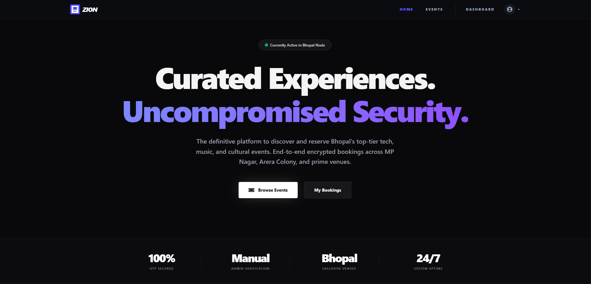
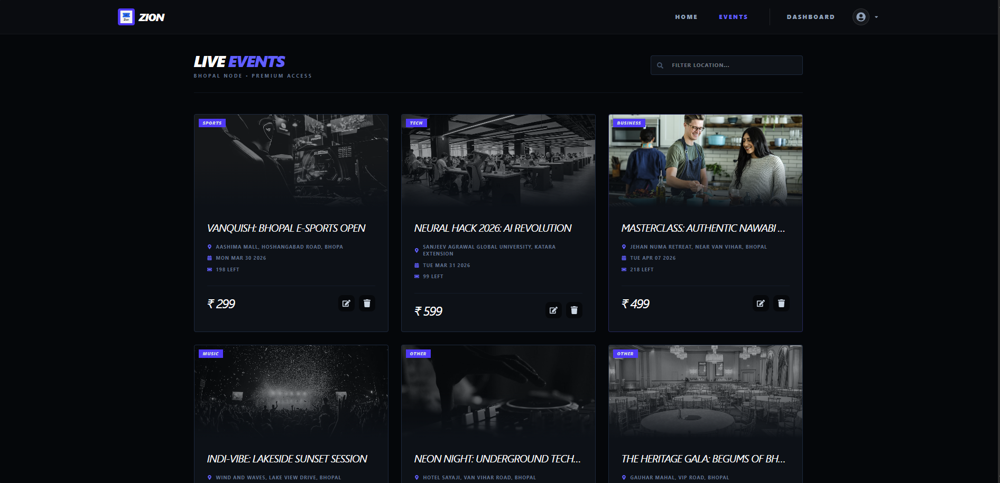
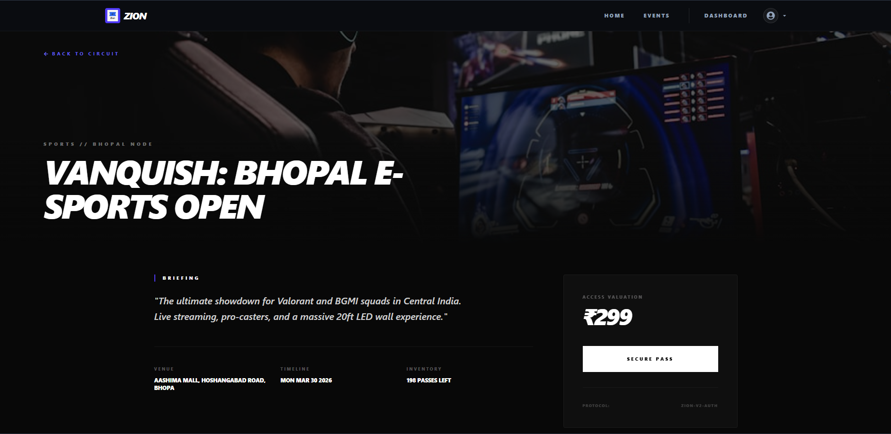
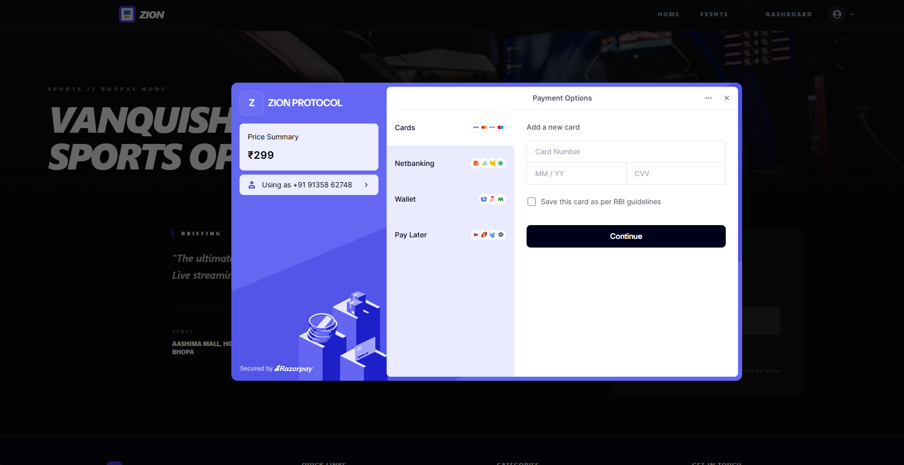
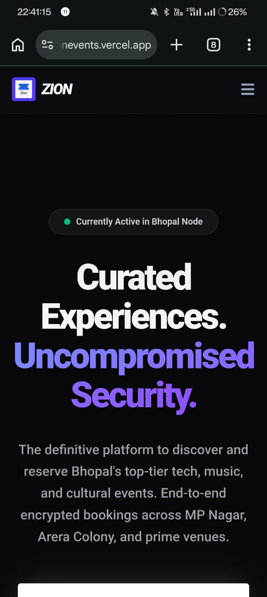
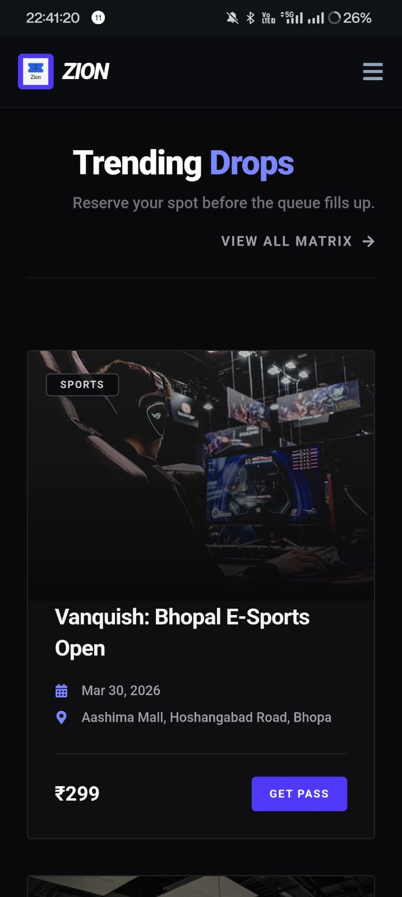
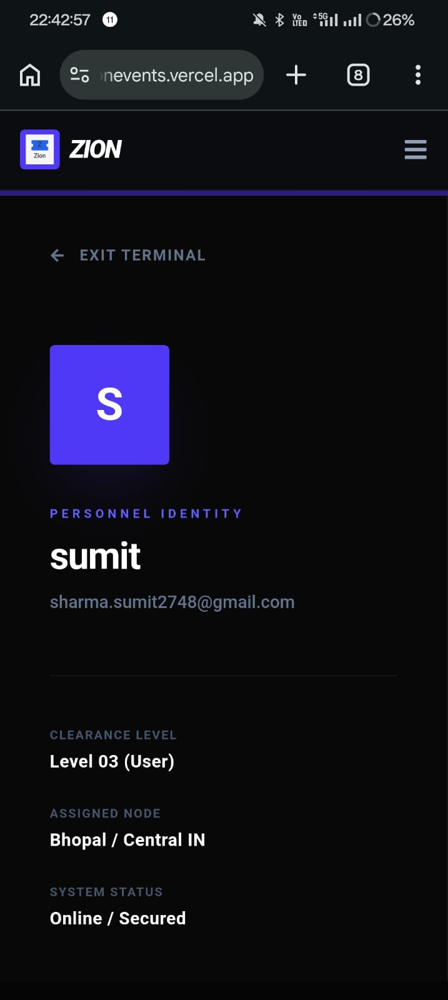

# ZION - Premium Event Booking Platform

ZION is a full-stack event booking platform built to deliver a smooth and secure ticket booking experience. It allows users to explore events, select seats, complete payments securely, and manage bookings with a modern and responsive interface.

The platform is designed with performance, scalability, and user experience in mind, featuring optimized data handling, secure authentication, and production-ready deployment.

## Live Demo

- Live Site: https://zionevents.vercel.app/

## Screenshots

## Desktop view

### Home Page

### Event Page

### Event Details

### Payment Page

## Mobile View

### Home Page

### Event Page

### Profile page

## Features

- Browse and discover upcoming events
- Real-time seat availability and booking flow
- Secure payment integration for ticket purchases
- User authentication and authorization
- OTP/JWT-based secure user access
- Booking management and order tracking
- Responsive UI for desktop and mobile devices
- Admin-ready architecture for event and booking management
- Optimized database queries and indexing for better performance

## Tech Stack

### Frontend

- React.js
- Context API
- Tailwind CSS
- Axios

### Backend

- Node.js
- Express.js

### Database

- MongoDB
- Mongoose

### Authentication & Security

- JWT Authentication
- OTP Verification
- Role-Based Access Control

### Payments

- Razorpay

### Deployment

- Vercel
- Render

## Problem It Solves

Managing event bookings manually can lead to poor user experience, payment issues, and seat allocation conflicts. ZION solves this by providing a streamlined booking workflow with secure payments, better event management, and a scalable architecture suitable for real-world use.

## Highlights

- Built a production-style booking platform with secure payment flow
- Improved booking experience with real-time seat handling
- Focused on scalability using optimized MongoDB queries and indexing
- Designed for reliability with separated frontend and backend deployment

## Getting Started

- Prerequisites
- Node.js
- MongoDB
- Razorpay account
- Git

## Installation

git clone <your-repository-url>
cd zion

## Frontend Setup

- cd client
- npm install
- npm run dev

## Backend Setup

- cd server
- npm install
- npm run dev

## Author

- Sumit Sharma

- Email: sumitkumarsharma2748@gmail.com
- LinkedIn: https://www.linkedin.com/in/ssumitsharma1/
- GitHub: https://github.com/Aestheticsumit234
